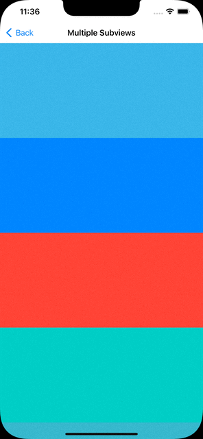
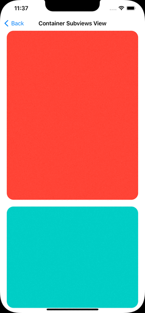
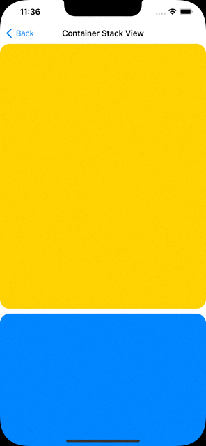
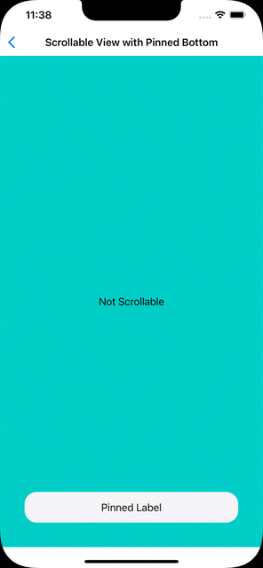

### Programmatic Autolayout UIScrollView Examples

##### Multiple Subviews Constrained to Scroll View

##### One Container View Constrained to Scroll View

##### One Container Stack View Constrained to Scroll View

##### Pinned Bottom Content to Fill Height of Scroll View

